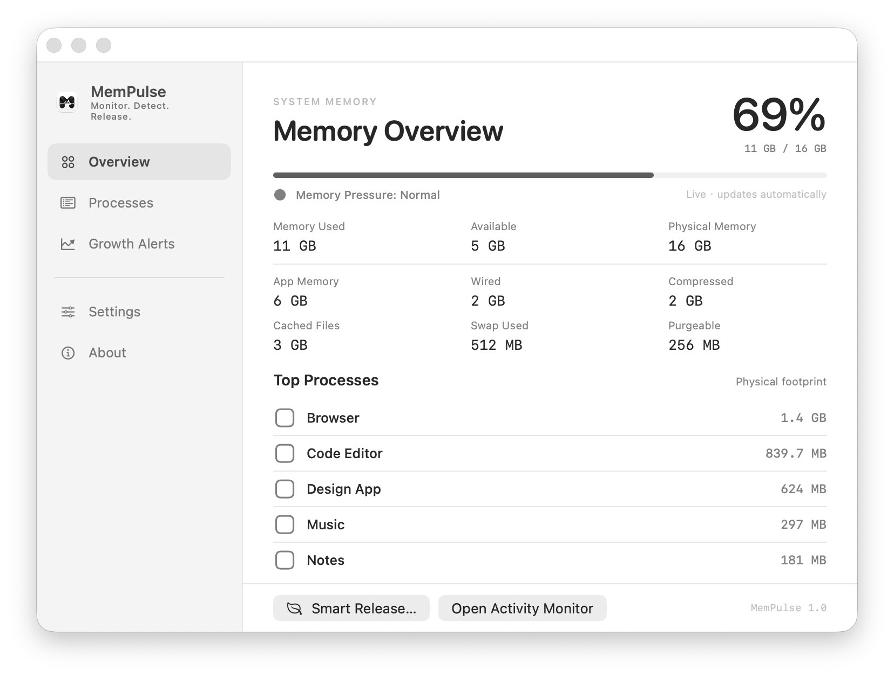
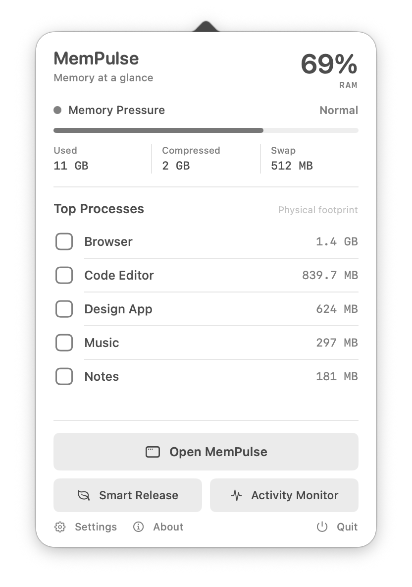
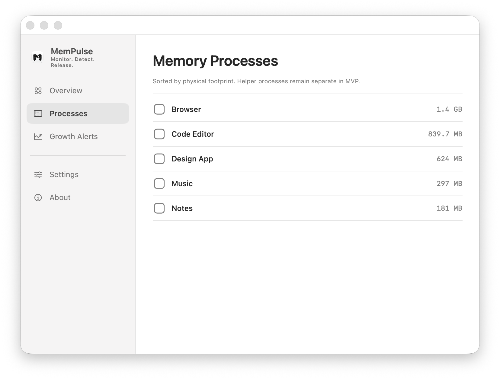

# MemPulse

[English](README.md) | [简体中文](README.zh-CN.md)

**Monitor. Detect. Release.**

MemPulse is a lightweight, native memory monitor for macOS. It combines a compact menu bar readout with a full application window, focusing on the signals that matter: Memory Pressure, compressed memory, swap activity, top memory-consuming processes, and sustained process growth.

MemPulse does not label normal file caches as junk, manufacture memory pressure to make a number look smaller, or require elevated privileges for its core features.

## Preview



| Menu bar popover | Process list |
|---|---|
|  |  |

The screenshots use illustrative process names and memory values. They do not contain data from a user's Mac.

## Features

- Fixed 28 pt menu bar canvas with centered, two-line 10 pt `80% / RAM` text
- Native application window with Overview, Processes, Growth Detection, Settings, and About
- Continues monitoring from the menu bar after the main window is closed
- Physical, Used, Available, App, Wired, Compressed, Cached, Purgeable, and Swap memory
- Direct macOS normal / warning / critical Memory Pressure status
- Top 5 and full process lists sorted by physical footprint
- Ten-minute in-memory history with five-minute sustained-growth detection
- Memory growth, Memory Pressure, and configurable RAM-threshold notifications
- User-selectable RAM threshold from 70% to 95% (85% recommended)
- Conservative Smart Release using normal application termination only
- English, Simplified Chinese, and Follow System language options
- Launch at Login using `SMAppService`
- One-click access to Activity Monitor

## Requirements

- macOS 13.0 or later
- Apple Silicon or Intel Mac
- No administrator, Accessibility, or Full Disk Access permission required for monitoring or Smart Release

## Install and Run

A prebuilt universal application is included at:

```text
dist/MemPulse.app
```

Copy it to `/Applications` and open it. The repository build is ad-hoc signed; a broadly distributed download still requires Developer ID signing and Apple notarization for a seamless Gatekeeper experience.

## Build

Open `MemPulse.xcodeproj` in Xcode and run the MemPulse scheme, or build from Terminal:

```bash
xcodebuild -project MemPulse.xcodeproj \
  -scheme MemPulse \
  -configuration Release \
  -derivedDataPath build/release \
  ARCHS='arm64 x86_64' \
  ONLY_ACTIVE_ARCH=NO \
  build
```

The checked-in Xcode project can also be regenerated from `project.yml` with [XcodeGen](https://github.com/yonaskolb/XcodeGen).

Run the test suite with:

```bash
xcodebuild -project MemPulse.xcodeproj \
  -scheme MemPulse \
  -configuration Debug \
  -derivedDataPath build/tests \
  test
```

## RAM Calculation

MemPulse uses the runtime Mach page size and `host_statistics64(HOST_VM_INFO64)`:

```text
Cached Files ≈ (external pages + purgeable pages) × page size
Available    = min(Physical, Free + Cached Files)
Memory Used = Physical − Available
RAM %       = Memory Used ÷ Physical × 100
```

This residual approach tracks Activity Monitor's headline “Memory Used” more closely on Apple Silicon than simply adding App, Wired, and Compressed memory, where GPU and system-reserved pages may not be fully represented. RAM percentage remains a secondary overview signal; status colors and risk assessment prioritize macOS Memory Pressure.

## Smart Release

Smart Release is not a RAM cleaner:

- Candidates are ordinary GUI applications owned by the current user.
- The frontmost app, MemPulse, Finder, system services, and protected processes are excluded.
- Nothing is selected by default; the user chooses every application.
- MemPulse only calls `NSRunningApplication.terminate()`. Applications may prompt to save, refuse, or delay termination.
- Force Quit, `purge`, sudo, root helpers, private APIs, and allocate-then-free tricks are not used.
- “Estimated potential” is the selected processes' current physical footprint. The measured system-wide result may differ.

## Background Operation and Quit

- Closing the main window or pressing `Command-W` hides the Dock icon while menu bar monitoring continues.
- Choose “Open MemPulse” from the menu bar popover to restore the Dock icon and main window.
- Choose “Quit” in the popover, or “Quit MemPulse” in the application menu, to stop monitoring and exit.

## Performance and Data Lifecycle

- System memory is sampled every 2 seconds and processes every 5 seconds by default on a utility serial queue.
- Growth history stays in memory, retains only 10 minutes, and is capped at 60 processes.
- Processes leaving the tracked set are removed immediately; no history is written to disk.
- The menu bar image is regenerated only when its percentage or pressure state changes.
- Sampling and growth storage are deliberately bounded to keep long-running resource use predictable.

## Privacy

MemPulse is fully local and makes no network requests. It does not upload memory statistics, process names, bundle identifiers, or system information, and contains no analytics, advertising, telemetry, or tracking SDKs.
